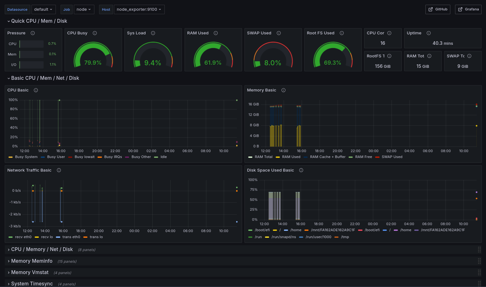
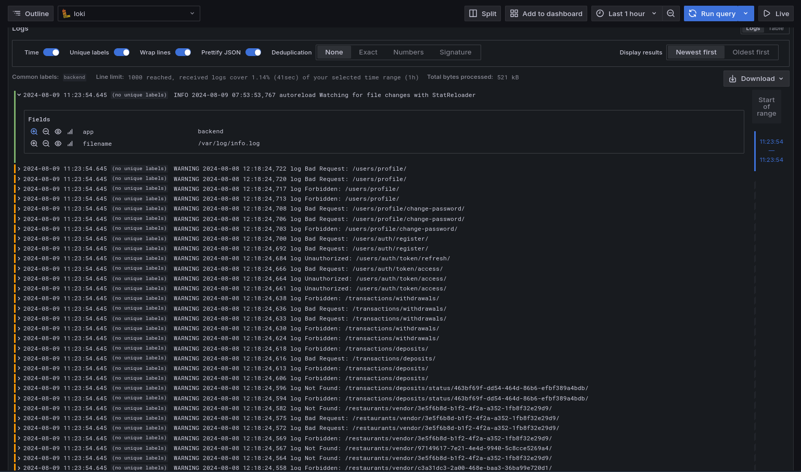

## FoodAnywhere

## Table of Contents
- [Introduction](#introduction)
- [Technologies](#technologies)
- [Monitoring](#monitoring)
  - [Node Exporter](#node-exporter)
  - [Loki](#loki)
- [Application](#application)
  - [User](#user)
  - [Active Session](#active-session)
  - [Locations](#locations)
  - [Restaurants](#restaurants)
  - [Products](#products)
  - [Carts](#carts)
  - [Orders](#orders)
  - [Transactions](#transactions)
- [Installation](#installation)
  - [Docker Compose](#docker-compose)
  - [Kubernetes](#kubernetes)
- [Run Tests](#run-tests)

## Introduction
FoodAnywhere is a comprehensive platform designed to make food ordering and delivery easier for both customers and vendors.
Vendors can easily register their restaurants, manage their menus, and add products to the system. Customers, on the other hand, can effortlessly search for nearby restaurants, browse menus, and place orders with just a few clicks.

## Technologies


This project uses <a href="https://docs.djangoproject.com/">Django</a> as the backend framework, with <a href="https://www.postgresql.org/">PostgreSQL</a> and <a href="https://postgis.net/">PostGIS</a> for database management and geographic data handling. The application is containerized using <a href="https://www.docker.com/">Docker</a> and orchestrated with <a href="https://kubernetes.io/">Kubernetes</a>.

For background task processing, <a href="https://docs.celeryq.dev/en/stable/">Celery</a> is used, with <a href="https://redis.io/">Redis</a> serving as both the caching layer and the message broker. Monitoring and logging are handled with <a href="https://grafana.com/">Grafana</a>, <a href="https://prometheus.io/docs/guides/node-exporter/">Node Exporter</a>, <a href="https://grafana.com/docs/loki/latest/getting-started/promtail/">Promtail</a>, and <a href="https://grafana.com/oss/loki/">Loki</a>.

Testing is managed with <a href="https://docs.pytest.org/en/stable/">pytest</a> to ensure code quality and reliability.


## Monitoring
This project has been set up with monitoring and logging capabilities. The following tools are used for monitoring:

### Node Exporter
This tool is used to collect system metrics from the nodes in the Kubernetes cluster. It provides information about CPU, memory, disk, and network usage, among other things.

Here is an example of the Node Exporter dashboard in Grafana:


### Loki
Loki is a log aggregation system that is used to store and query logs from the application. It is integrated with Grafana, which allows for easy visualization and querying of logs.

Here is an example of the Loki dashboard in Grafana:


## Application
To make the application easier to understand, we have divided it into several components. Each component is responsible for a specific part of the application. The components are as follows:

### User
This component is responsible for managing user accounts. It handles user registration, and login, as well as user profile management.
Authorization is handled using JSON Web Tokens (JWT).

### Active Session
To keep track of active user sessions, this component is used. It stores information about the user, the device, and the IP address of the user's current session.

### Locations
To find nearby restaurants, this component is used. It stores information about the location of restaurants and provides functionality to search for restaurants based on the user's location.

### Restaurants
This component handles all vendor-specific and customer-specific functionalities related to restaurants.

Some functionalities include:
#### Vendor Specific
- Registering a new restaurant
- Managing restaurant details
#### Customer Specific
- Viewing Nearby Restaurants
- Viewing Restaurant Details

### Products
This component is responsible for managing and displaying products.
Vendors can easily add products to their restaurant's menu, while customers can browse products and add them to their cart.

### Carts
The cart component acts as a temporary storage for products that the user wants to order. It allows users to add, remove, and update products in their cart.
All the items get saved in a cache until the user places an order.

### Orders
The order component is responsible for managing orders for both vendors and customers.
Customers can place orders, pay or cancel orders, and view their order history.
Vendors can view and manage orders that have been placed at their restaurant. So they can update the status of the order.

### Transactions
This component keeps track of all transactions that occur on the platform.
This includes payments made by customers, refunds, and other financial transactions.

## Installation
You can run FoodAnywhere either using Docker Compose or Kubernetes in either a local or production environment.

### Docker Compose
To run the application using Docker Compose, follow these steps:
1. Clone the repository
```shell
git clone https://github.com/mohamad-liyaghi/FoodAnywhere.git
```
2. Change to the project directory
```shell
cd FoodAnywhere/
```
3. Run the project
```shell
make run
```
* To run in production mode, use the following command:
```shell
make deploy
```

### Kubernetes
To run the application using Kubernetes, follow these steps:
1. Clone the repository
```shell
git clone https://github.com/mohamad-liyaghi/FoodAnywhere.git
```
2. Change to the project directory
```shell
cd FoodAnywhere/
```
3. Create ConfigMaps
```shell
make local_confmap
```
* To create ConfigMaps for production, use the following command:
```shell
make prod_confmap
```
4. Deploy the application
```shell
make k8s
```

## Run Tests
This project uses <a href="https://docs.pytest.org/en/stable/">Pytest</a> for testing. To run the tests, run the following command
```shell
make test
```
